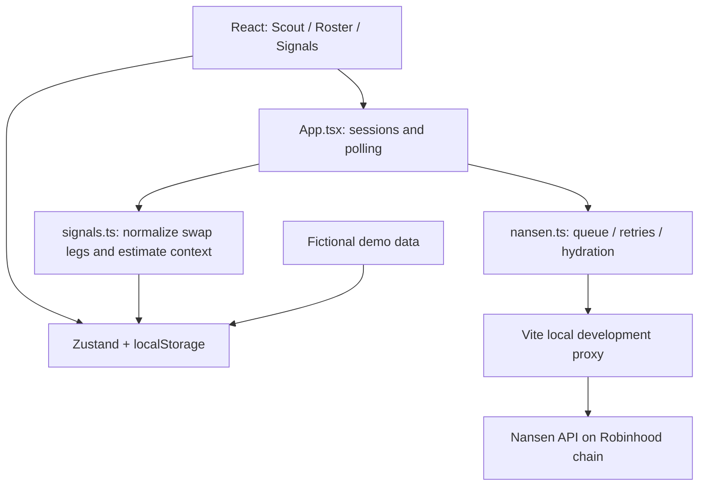

# Smartcrush — evaluation handoff for Claude

Prepared by Codex on **18 September 2026, 20:30 SGT**. Updated after a visual-polish pass at **21:16 SGT**.

**Workspace:** `/Users/lfgcap/Desktop/Nansen Smart Money`

**Authoritative brief:** [CODEX_BUILD_PROMPT.md](</Users/lfgcap/Desktop/Nansen Smart Money/CODEX_BUILD_PROMPT.md>)

**Application:** [local preview](http://127.0.0.1:5173/)

## 1. What you are evaluating

The user explicitly asked Codex to disregard the earlier project work and build from `CODEX_BUILD_PROMPT.md`, recently written by Claude. Codex built a new React application at the workspace root, branded **Smartcrush**, implementing the brief’s “Smart Money Tinder” concept.

The user subsequently identified `backend/.env` as the location of the existing Nansen API key. The local application now uses that credential through a Vite development proxy. A live 20-card Robinhood wallet deck was visibly loaded, and the displayed first wallet’s current holdings were verified after correcting a live API validation issue.

**Assessment boundary:** this is a working local v1 with demo and live discovery, not a production-deployed service. Live end-to-end signal monitoring and since-match performance have not been validated against a real, populated roster over time. The automated browser suites passed before the final proxy and holdings-repair changes; those final changes received unit/build checks and targeted live UI verification, not another complete browser-suite run.

After this handoff was first drafted, a CSS-only polish pass increased small supporting text, improved card contrast and depth, strengthened touch affordances, and refined the desktop surround. Scout and Signals were visually rechecked in the live in-app browser after that pass. No state, API, or interaction behavior changed.

Please evaluate independently against the original brief. Treat this document as a factual implementation inventory and a starting point for review, not a certification that every requirement is fully satisfied. Start with findings and evidence; distinguish observed defects from concerns that still need reproduction. The current request is evaluation, not authorization to deploy or execute trades.

## 2. Project boundaries and source of truth

The current app lives in root-level `src/`, `package.json`, `vite.config.ts`, and `index.html`. Run all commands from the workspace root.

Earlier work remains on disk:

- `backend/`: legacy application code and data. **Only `backend/.env` is used by the new app.** Its server is not started or called by this implementation.
- `frontend/`: legacy build output and an existing nested Git repository. This is not the current React app.
- `handoffs/01-backend-scaffold-handoff.md` and `prompts/`: previous-project artifacts, not current design authority.

Do not mistake the legacy nested repository or `frontend/dist` for the application under review. The new production output is root-level `dist/`. No deployment, PR, or commit was created for this build.

Supporting documentation: [README.md](</Users/lfgcap/Desktop/Nansen Smart Money/README.md>). One wording caveat: its opening says the old backend directory is unused, but its configuration section correctly describes the `backend/.env` exception.

## 3. Run, inspect, and test

### Local live application

```sh
cd '/Users/lfgcap/Desktop/Nansen Smart Money'
npm install
npm run dev
```

The live development server binds to `127.0.0.1:5173`. It was running at the last verification; if it is already running, use it rather than starting a competing server. Port selection is strict.

When `NANSEN_API_KEY` exists in `backend/.env`, a fresh session automatically selects live mode. If the browser previously selected demo mode, open **Connection settings → Use project API key**. Live and demo rosters are separate and retained when switching modes.

Do not print or paste the actual API key into the handoff, logs, screenshots, issues, or source code. The key was not copied into root `.env.local` or committed source.

### Automated checks

```sh
npm test
npm run build
```

Browser checks use an isolated test server with the project key disabled:

```sh
# Terminal 1, from the workspace root:
npm run dev:test

# Terminal 2, from the same directory:
npm run test:browser
```

`dev:test` uses port **5174** and Vite mode `test`. Both browser scripts default to `http://127.0.0.1:5174`; `APP_URL` can override this. They require installed Google Chrome and create isolated browser contexts. They do not use the user’s existing browser state.

Keep these suites pointed at the test server: their setup assumptions require no automatic project-key connection. The API suite intercepts Nansen responses; it is not a substitute for testing the real local proxy.

`npm run preview` previews the static build. It does not provide a working production live-data service. Demo mode is the reliable static-build path until a production proxy is implemented.

### Optional live diagnostic

```sh
node scripts/check-live.mjs
```

This reads the existing key without printing it and makes a discovery request for three trades, then a holdings request for one returned wallet. It prints status/count information and API errors. It uses real Nansen API credits and bypasses the UI/proxy, so it only establishes upstream API behavior.

## 4. Architecture and file map



| File / directory | Responsibility |
| --- | --- |
| `src/App.tsx` | Tabs, connection state, refresh orchestration, request-generation guards, current-holdings repair, modals, and toasts. |
| `src/store/useAppStore.ts` | Persisted state, roster capacity, held cards, swipe transitions, breakups, and signal merging. |
| `src/services/nansen.ts` | Nansen requests, serialization, retry handling, pagination, discovery, PnL normalization, and profile hydration. |
| `src/services/signals.ts` | Swap-leg extraction, deduplication, reverse balance reconstruction, and validated DEX links. |
| `src/services/demo.ts` | A pool of 60 fictional profiles and deterministic sample signals. |
| `src/components/SwipeDeck.tsx` | Framer Motion drag behavior, match/pass stamps, swipe threshold, and tap actions. |
| `src/components/SwipeCard.tsx` | Profile artwork, wallet identity, stats, trophy case, and holdings. |
| `src/components/RosterList.tsx`, `RosterEntry.tsx` | Aggregate and per-wallet roster displays. |
| `src/components/SignalsFeed.tsx`, `SignalCard.tsx` | Feed, refresh action, estimated context badges, and external links. |
| `src/components/Connection.tsx` | Manual key input, existing-project-key action, and demo selection. |
| `src/components/Modal.tsx` | Dialog focus containment, Escape handling, and focus restoration. |
| `src/index.css` | Fixed 390px phone layout and coral/cream design system. |
| `src/types/index.ts`, `src/utils/` | Domain types, formatting, and timing constants. |
| `vite.config.ts` | React build setup and development-only credentialed proxy. |
| `tests/logic.test.ts` | Eleven unit tests. |
| `scripts/verify-browser.mjs` | Demo workflow and layout browser checks; screenshots. |
| `scripts/verify-api.mjs` | Browser checks using mocked Nansen responses. |

Installed versions recorded from `package-lock.json`: React/React DOM 19.3.0; Vite 6.4.3; TypeScript 5.8.3; Zustand 5.0.15; Framer Motion 12.43.0; Playwright 1.63.0; Vitest 3.2.7. `package.json` uses version ranges for several packages; the lockfile records the installed resolution.

## 5. Requirements coverage and deliberate differences

| Brief requirement | Implemented behavior / evaluation note |
| --- | --- |
| Always-mobile layout | Fixed 390px frame, full viewport/dynamic viewport height, centered on dark desktop background. Main content scrolls; bottom tabs remain visible. No layout breakpoints. |
| Scout / Roster / Signals | All three tabs exist and share persisted state. |
| Swipe stack | One profile with a decorative card behind it, horizontal drag, rotation, stamps, snap-back, and buttons. The rear card is decorative, not the next wallet’s rendered profile. |
| Wallet profile | Truncated address, raw Nansen label, win rate, realized PnL, traded-token count, top three winning trades, and up to four visible holding chips. Data retains up to five trophies and holdings. |
| 20-card sessions / four-hour refresh | Implemented with fewer cards when the eligible pool is smaller. Empty and exhausted states include a countdown. |
| Avoid repeated wallets | A rolling 24-hour exclusion based on displayed wallets, not permanent pool-cycle tracking. The first profile is marked seen at deck creation and the next profile when a swipe advances. |
| Ten-wallet roster | Capacity enforced in the store and UI; matches retain scouting snapshots and matching timestamps. |
| Hold a rejected match | `heldWalletAddress` persists the waiting wallet; deck replacement is blocked even across session expiry until that card is passed or matched. |
| Breakups | Confirmation/cancellation, removal from roster and feed, and a toast after making room. |
| Since-match performance | Requeries realized PnL with the wallet’s matching timestamp as the start date. Does not subtract two rolling all-time snapshots. |
| Signals | Reverse-chronological feed with wallet, token, action, USD amount, quantity, timestamp, and context. Cached feed limited to 1,000 signals. |
| Hourly polling | Checked by a 10-second scheduler while the document is visible; also polls on load, roster changes, and manual refresh. A visible tab returning from the background can catch up. |
| Copy this trade | Opens the token’s Robinhood-chain page on Uniswap. It does not prefill size or direction, connect a wallet, or execute. This uses the brief’s minimum DEX-navigation fallback. |
| Auto-copy / premium | Disabled auto-copy switch and nonfunctional premium presentation, labeled coming soon. |
| Persistence | Separate `demo` and `live` state under localStorage key `smart-crush-v1`, schema version 1. No account/backend persistence. |
| Missing key | Setup screen plus labeled demo mode; local project key is detected when available. |
| Loading states | Scout and Signals skeletons exist. Roster renders cached state immediately; it does not have a separate dedicated roster-loading skeleton. |
| Visual theme | Warm cream cards and background with coral actions, rather than an all-dark inner app. Desktop surround is dark. Match button is coral, not green. Green/red are used for PnL. |
| Browser-only direct API calls | Changed for local operation because direct Nansen browser access failed. Vite supplies a development-only proxy; there is no separate backend process. Production equivalent is not implemented. |

No authentication, wallet connection, trade execution, subscriptions, push notifications, social features, or public deployment were added.

## 6. Nansen integration: contracts and live findings

### Credential and request path

In local development, `vite.config.ts` reads `NANSEN_API_KEY` from `backend/.env`. The client receives a boolean `VITE_NANSEN_LOCAL_PROXY`, not the key. Requests go to `/api/nansen/api/v1/...`; the Vite proxy strips `/api/nansen`, targets `https://api.nansen.ai`, supplies the key, and removes the browser Origin header.

Only these endpoint paths are proxied:

- `POST /api/v1/smart-money/dex-trades`
- `POST /api/v1/profiler/address/pnl-summary`
- `POST /api/v1/profiler/address/pnl`

The path allowlist is a proxy regular expression. It is not a full request-body validator or production authentication layer. An explicitly supplied incoming `apikey` header takes precedence over the project key. Review this boundary before any hosted deployment.

The project-key loading branch is disabled for build commands and test mode. The latest production JavaScript files were searched for the exact backend key in memory; the check passed without printing the key.

A separate, optional `VITE_NANSEN_API_KEY` path still exists. Unlike the backend-key path, setting that variable for a production build exposes its value in the frontend bundle. Do not interpret the verified backend-key exclusion as a claim that every possible configuration is secret-safe.

### API differences from the prompt

1. **Robinhood chain support:** the current endpoint schema includes `robinhood` for both Smart Money and Profiler PnL. An initial search snippet was stale; the schema and successful live request supersede it.
2. **Dates:** summary requests require dates. Although the PnL detail schema exposed an optional date, a live holdings request without it returned HTTP 400: `Either 'from' or 'to' date must be provided`. All current PnL requests now include a nonempty range.
3. **Headline date scope:** epoch-to-now is requested to include available chain history. Since-match queries use `addedAt` to now. Do not equate “epoch-to-now requested” with proof of complete lifetime data coverage.
4. **Detailed ROI:** the current schema describes `roi_percent_realised` as a ratio not multiplied by 100. Code uses `1 + ratio`; the brief’s `/100 + 1` conversion was not used. Summary `realized_roi` is not blindly interpreted; detail rows provide the displayed multiple. Missing detailed ROI becomes `null`/an em dash.
5. **Holdings:** per-wallet PnL with `show_realized: false`, sorted by `holding_usd`, supplies current positions. Aggregate Smart Money holdings is not used.

Official references consulted during implementation:

- [Nansen DEX Trades schema](https://docs.nansen.ai/api/smart-money/dex-trades)
- [Nansen PnL summary and detail schema](https://docs.nansen.ai/api/profiler/address-pnl-and-trade-performance)
- [Uniswap’s Robinhood announcement](https://blog.uniswap.org/robinhood-chain-is-live)

### Request scheduling and pagination

Calls are serialized through one module-level promise queue. Starts are separated by at least 260ms, with a 30-second request timeout. HTTP 429 and 5xx errors retry up to three times. Numeric and HTTP-date `Retry-After` headers are parsed. Mode/key changes abort active and queued work; generation checks prevent stale results from replacing the current session.

Discovery, holdings, and roster trades use the shared pagination helper: 1,000 rows per page, up to 20 pages. A limit hit throws rather than quietly treating a partial result as complete. Detail trophies request ten rows ordered by realized ROI. Empty/invalid summary data and zero traded-token counts are skipped during hydration; an HTTP failure of the summary request can fail the whole deck load. Optional detail/holdings failures produce a partial profile. An unavailable current card’s holdings can be repaired separately without replacing its deck position.

A nominal 20-wallet deck needs discovery pages plus about 60 profile requests, and potentially more holdings pages or skipped-wallet summaries. A full roster poll needs trade pages plus roughly 20 PnL/holdings requests. These are request counts, not a verified credit-cost quotation.

## 7. State and signal semantics

Each mode stores: deck, position, refresh timestamp, held wallet address, timestamped seen-wallet map, roster, signals, signal IDs, and last poll timestamp. The seen map is a JSON-friendly object rather than a JavaScript Set. `seenTxHashes` currently contains full composite signal IDs, despite its name; merging is actually handled through a Map of cached signals.

A roster entry holds the scouting profile, `addedAt`, `pnlSinceAdded`, and `pnlUpdatedAt`. It begins at zero on matching. Successful later summary requests replace its since-match PnL. Failed updates retain the last value and check timestamp. Aggregate PnL sums current roster members; it does not retain realized performance from wallets that have been removed.

Signals are derived from both swap legs, with configured quote symbols omitted. Current quote symbols include USDG, USDC, USDT, DAI, USD, USDC.E, WETH, ETH, WBTC, and BTC. Other token-to-token swaps retain both buy and sell legs. The same transaction value can consequently appear on both legs; these cards should not be summed as independent trading volume.

Context reconstruction starts at current holdings and walks trades newest-to-oldest. A buy is subtracted to estimate the prior balance; a sell is added back. The inferred before/after balances determine new position, adding, partial sale, or full exit. Missing quantities or holdings return unknown context. Transfers, delayed indexing, incomplete history, and ambiguous trade order can invalidate the reconstruction. The UI marks context as estimated. “Taking profit” currently means partial sale, not verified positive realized profit.

Only the trailing 24 hours can be fetched from the trade endpoint. Historical signals already observed remain cached; the feed is not strictly filtered to 24 hours. A closed app cannot poll, and gaps longer than the endpoint window are unrecoverable here. PnL summary figures may be cached upstream for approximately an hour.

## 8. Evidence and test status

### Last recorded final-code checks

- `npm test`: **11 tests passed** after the local proxy and holdings-date/repair changes.
- `npm run build`: **passed** after those changes.
- Exact backend-key search in the generated JavaScript: **passed**.

These results were recorded during the implementation immediately before this handoff. Tests were not rerun solely to write the document.

### Earlier automated browser runs

The demo browser script passed: 390px width on desktop and mobile, matching/passing, roster capacity, full-roster modal, breakup cancellation and confirmation, held-card resumption, reload persistence, signals, exhausted deck, four-hour rollover, and a pointer drag in a mobile-sized context. No page errors were observed by its desktop-page listener.

The mocked API script passed: invalid-key error and recovery, a 429 retry, correct chain/date fields, duplicate discovery, skipping an empty summary, smaller decks, detailed ROI normalization, holdings context, live-mode signal rendering, Uniswap token link, refresh deduplication, empty discovery, no manual key in persisted state, and retained roster after reconnecting.

**Important qualification:** both suites passed before the final local-key/proxy integration. Their default URL was subsequently changed to test port 5174, and an additional date assertion was added for PnL detail/holdings. The final scripts at this handoff snapshot have not been rerun end-to-end. Run them as described above before treating them as final regression evidence.

### Live verification actually performed

- Existing backend key authenticated against Nansen.
- Discovery returned HTTP 200 with three sample Robinhood trades in the diagnostic.
- That direct response lacked `Access-Control-Allow-Origin`; the browser also visibly failed direct access. Local proxy routing resolved the observed failure.
- The real app visibly loaded **Card 1 of 20** in live mode.
- The displayed wallet `0xb8f3…04ea` showed 58% win rate, approximately +$3.9M realized PnL, and 57 tokens at that observation.
- The initial holdings request failed without dates. After correction and cached-profile repair, that same card visibly displayed AI, WETH, SCHIFFY, and OPEN holding chips.

These values are transient UI observations, not audited performance claims. The first displayed card was checked; all twenty wallets were not individually inspected. No live wallet was matched by Codex to validate a real roster’s subsequent trades. No transaction was executed.

### Screenshots

Existing `artifacts/` images are **demo-mode screenshots**, captured before the final local-key connection changes. They are visual evidence of the layout, not proof of live data:

- [Scout, mobile](</Users/lfgcap/Desktop/Nansen Smart Money/artifacts/scout-mobile.png>)
- [Scout, desktop](</Users/lfgcap/Desktop/Nansen Smart Money/artifacts/scout-desktop.png>)
- [Roster, mobile](</Users/lfgcap/Desktop/Nansen Smart Money/artifacts/roster-mobile.png>)
- [Roster, desktop](</Users/lfgcap/Desktop/Nansen Smart Money/artifacts/roster-desktop.png>)
- [Signals, desktop](</Users/lfgcap/Desktop/Nansen Smart Money/artifacts/signals-desktop.png>)
- [Setup, mobile](</Users/lfgcap/Desktop/Nansen Smart Money/artifacts/setup-mobile.png>)

## 9. Prioritized evaluation targets

The following are code-grounded limitations or concerns identified while preparing the handoff. They have not been silently fixed as part of this documentation request. Please confirm severity and reproduction independently.

| Priority | Target | What to examine |
| --- | --- | --- |
| High | Production live-data path | Vite’s development proxy is not a deployed API service. A static build does not solve CORS or securely provide the backend key. Decide the minimal hosting architecture before calling this production-ready. |
| High | Long `Retry-After` handling | `nansenPost` throws when the requested delay exceeds 60 seconds, but `App.tsx` sets a generic 60-second retry time. Manual retry also bypasses that timer. An upstream five-minute cooldown could be retried too soon. Check a typed retry deadline propagated to the UI scheduler. |
| High | Signal quote filtering | Filtering by symbol can hide ETH/BTC trades entirely and can suppress unrelated tokens sharing a quote symbol. Decide whether filtering should use chain-specific token addresses and whether ETH/BTC trades belong in the feed. |
| High | Multiple swaps in one transaction | Composite IDs preserve opposite token legs, but transactions with repeated swaps involving the same wallet/token/action can still collapse. The first dedup map also omits amounts and event/log identity. Check actual API row granularity before relying on transaction-level dedup. |
| High | Estimated context consistency | Test transfers, missing rows, tied timestamps, and reconstruction that creates negative balances. Current code stores an inconsistent negative reconstructed balance even when it declines to classify that leg, potentially affecting older signals. |
| Medium | Missing financial data | `trade_value_usd ?? 0` presents missing value as zero. Several raw types require values that may be nullable upstream. Prefer explicit unavailable data over fabricated zeroes; review runtime validation generally. |
| Medium | Reopening removed-wallet signals | Poll results are filtered by current roster addresses. If a wallet is removed and re-added while a previous poll is in flight, address matching alone may apply a result from the old matching period. Test `addedAt`/membership-generation identity. |
| Medium | Discovery volume and initial latency | The entire discovery result is paginated before choosing twenty candidates. More than 20,000 rows aborts discovery; fewer rows can still cost many calls. Evaluate bounded or incremental discovery and how not to starve unseen candidates. |
| Medium | Repeated polling and credits | The in-memory roster signature resets on page load, so reopening polls again even when the persisted poll is recent. Manual refresh has no lasting cooldown. These are deliberate current behaviors but may undermine the intended free-tier cadence. |
| Medium | Since-match PnL meaning | Reconcile at least one real wallet’s date-bounded realized PnL against Nansen. Confirm date inclusivity, cache lag, handling of positions opened before matching, and whether initial zero/retained stale values are clear. |
| Medium | Persisted schema robustness | Storage handles malformed JSON and write failures, but does not deeply validate valid JSON with a wrong shape, perform a schema migration, or synchronize multiple tabs. Check failure recovery without losing the live roster. |
| Medium | Mobile readability and accessibility | Many labels are 6–9px; some utility controls are below 44px targets. Review contrast, zoom, screen-reader announcements, long labels, and real-device thumb reach. No comprehensive accessibility audit was run. |
| Medium | Browser/device coverage | Chrome desktop and a mobile-sized browser context were exercised. Actual touch input on iOS/Safari, browser suspension/resumption, and older support for `AbortSignal.any/timeout` remain unverified. |
| Low / product decision | Fixed 390px at narrower widths | `body` and frame enforce a 390px minimum. This follows the literal brief but can overflow a narrower device. Ask whether strict width or fitting small phones is the desired behavior. |
| Low / product decision | Card art and labels | Artwork is CSS/SVG and index-based rather than unique wallet identity art. Raw Nansen labels may be long or read like promotional referral text. Assess whether this suits the intended trust and dating-profile presentation. |
| Low / product decision | Held-card countdown | A held prospect can survive past expiry while the countdown reaches zero. The hold is intentional; the surrounding refresh copy could explain the waiting state better. |

Other coverage gaps: no full hour-long live monitoring session, no actual performance reconciliation, no storage-quota UI test, no production deployment test, no multi-tab test, no full animation review with reduced motion disabled, and no verification that a Uniswap token page offers liquidity for every discovered token.

## 10. Suggested evaluation sequence and output

1. Read the original brief, this handoff, and the root app’s README. Ignore the legacy backend/frontend implementation as the evaluation baseline.
2. Run the final unit/build checks and isolated browser suites. Record any divergence from the earlier results.
3. Review the three screens in demo mode, including the eleventh-match rejection and a breakup followed by return to the held card.
4. Confirm the existing project-key path loads real data without exposing the backend key in browser source or the production bundle.
5. Review data normalization and signal semantics before trusting financial labels. Use mocked cases first; only make bounded live requests where needed.
6. Assess the deployment gap separately from local functionality. Do not mark the local preview as a finished public service.
7. Return an evaluation before making broad code changes.

Requested evaluation format:

- **Verdict:** local-v1 readiness and production readiness separately.
- **Findings:** severity, exact file/line, concrete trigger, observed or inferred effect, reproduction, and suggested remedy.
- **Spec coverage:** satisfied, partially satisfied, and missing requirements; identify justified deviations.
- **Data accuracy:** ROI, win rate, PnL scope, trade direction, deduplication, and context estimates.
- **UX:** mobile hierarchy, legibility, swipe behavior, full-roster flow, empty/error states, and dating-themed language.
- **Security/deployment:** actual secret path, proxy scope, production configuration, and credential handling.
- **Tests:** what you ran, results, and remaining evidence gaps.
- **Next steps:** an ordered list of fixes, separating launch blockers from polish and v2 work.

## 11. Review snapshot identifiers

SHA-256 values of key files at handoff preparation, to detect intervening edits:

```text
5a465f60ac2a861b2614a664367f48a6ddb7eec6625292d9b817b02f1935c6ad  src/App.tsx
3cc4df7f4fbaf7e538e3f7d2ebbf467b87122f3c7099c7dffa6bd2ecb2ccc693  src/services/nansen.ts
f728f364c74b7f39bda3bcfd86c6128c2feec3bee1767099371c54f4a1c22a90  src/services/signals.ts
c462ff8a1aa85f300c668843ba7dc7aa96b18532b9c52c2a9514da65030b957b  src/store/useAppStore.ts
c182abf4eb6208e0c71da102ad308b277f9ffd10d5704a530f346e151dae89c3  src/index.css
c86ab1a9db0aaac0c6b002039e60a92bbdec2114f010c113cd57123a9c0216a5  vite.config.ts
8f333166fc7f98a4addbe04d627effc65a0c0fe8699887e72206ac362ddae01b  package-lock.json
```

This handoff contains no credential values. Writing it did not change application behavior or consume additional Nansen API credits.
